# Rotating Color Display

## Abstract: 
 The Rotating Color Display is a compact disc-sized device that rotates quietly using a CD motor. It features 56 color LEDs that display animated color images as well as time and weather data sourced from the internet. The device is wirelessly powered and controlled via a user-friendly web interface. It uses ESP32 and RP2040 microcontrollers, pre-manufactured boards, and is easy to assemble.
 

 
  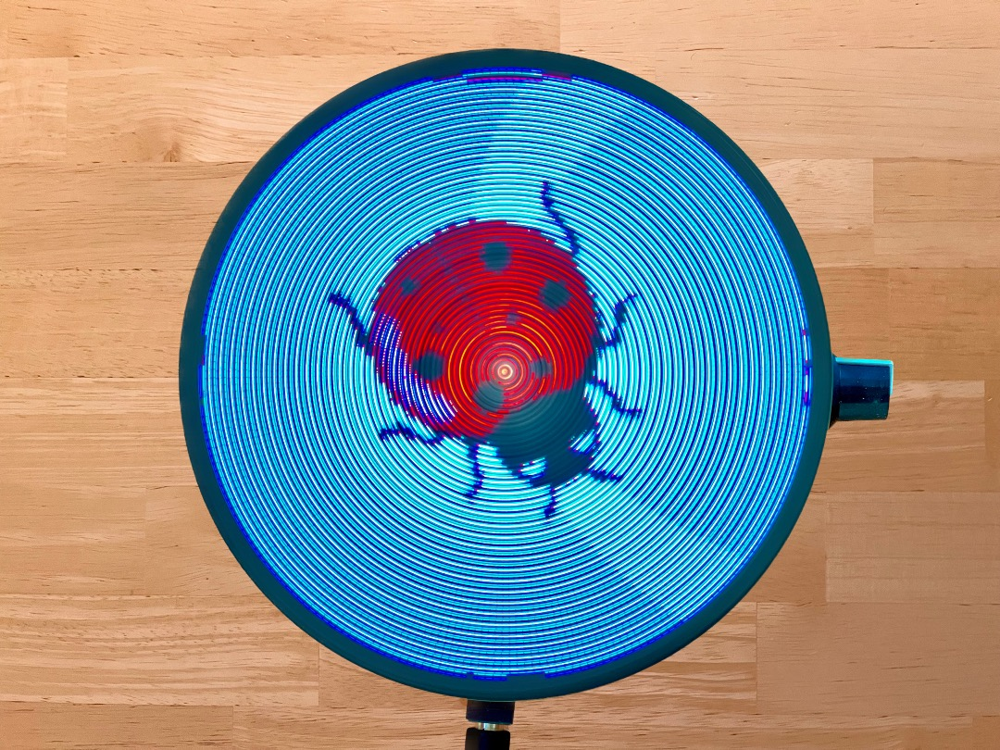

 
<a href="https://youtu.be/7XahXYzULtI?si=OmdDaNnT-Jkq3F4Q" target="_blank">
  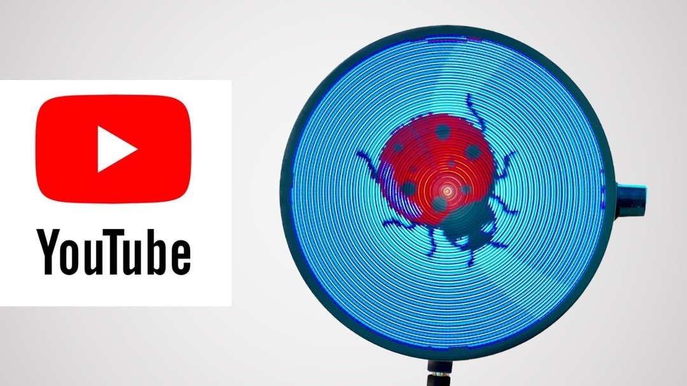
</a>

 

## 1. Description of the device

The Rotating Color Display device comprises two primary units: a power supply unit and a display board (**figure 1**). Both are circular in design, with a diameter of 120mm, similar to the dimensions of a standard Compact Disk. The display board is rotated by a CD motor. Energy is wirelessly transmitted from the power supply unit to the display board, eliminating the need for wired connections.

 
  

**Figure 1:  Rotating Color Display assembly.** The lower PCB is the power supply with wireless power transmission, the upper PCB is the display board.

The display board is equipped with a row containing 56 color LEDs. The LED operations are controlled by a RP2040 microcontroller, while an ESP32 microcontroller generates the display content. Images (including animated images) can be stored on and loaded from a micro SMD card. The ESP32 maintains a Wi-Fi connection to the internet.

This internet connection allows the device to retrieve the time from a time server, ensuring time accuracy. It also allows for the acquisition of weather data. Device operation is managed through a web interface (**figure 2**), accessible from any web browser. The interface allows users to manage login credentials, upload image files to the display, and control image and configuration files through a file manager.

 
  
  
  

 
  
  
  

**Figure 2:** The **web user interface** allows for operating mode selection and device configuration.

## 2. Operating modes

When switched on, the device tries to connect to a known wifi. If no valid wifi credentials are found, the unit will be configured as wifi access point. In this mode, a computer or mobile device can be connected, directly (SSID: RD40, no password). 

Once the wifi connection has been established, the unit will display its IP address on the  home page of the device (**figure 3**). Enter this address in your web browser. This will load the web user interface and will allow you to configure your local wifi.

 
  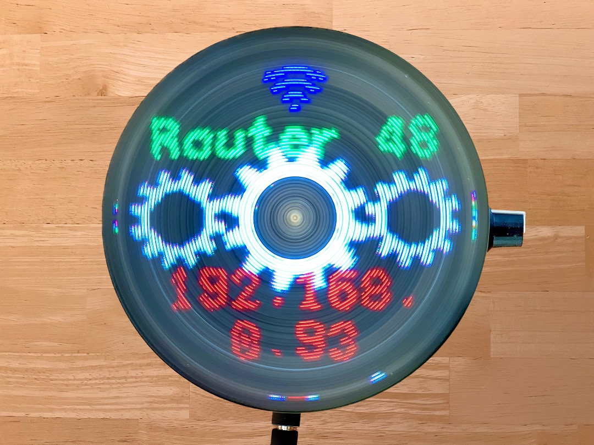

**Figure 3: home page.**

There are several operating modes that display time and weather information (**figure 4**). The logo clock mode integrates a customizable image into the clock face. The image can be easily uploaded from the user interface. The same is true for the analog clock, which uses a customizable clock face in the background.

 
  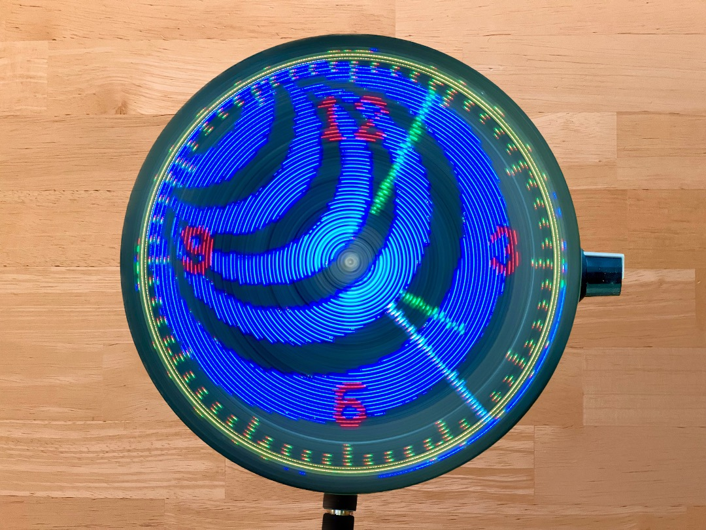
  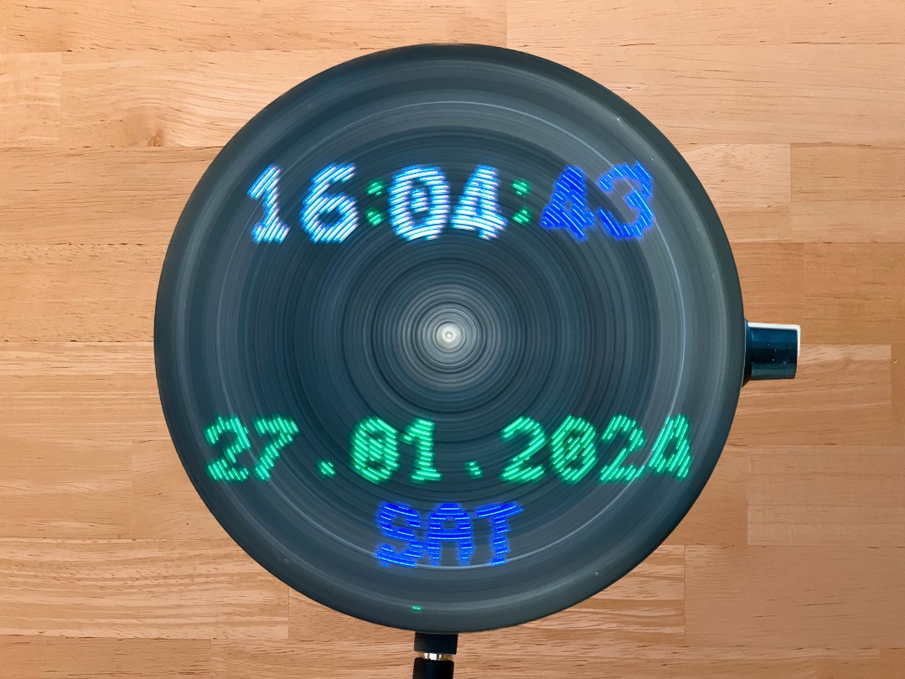

 
  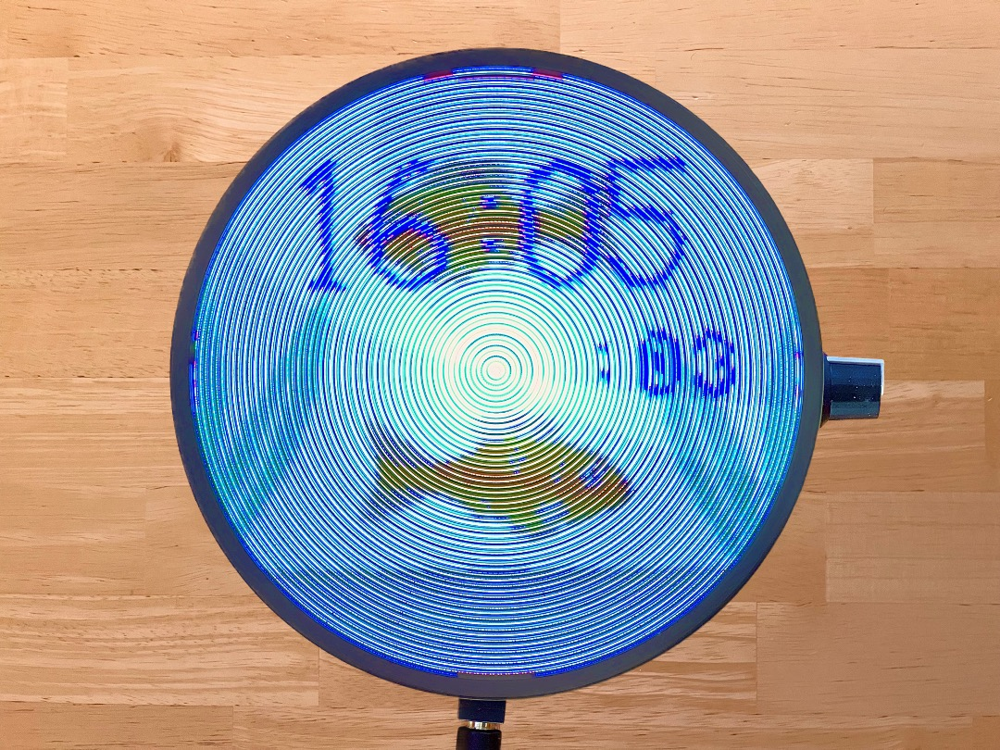
  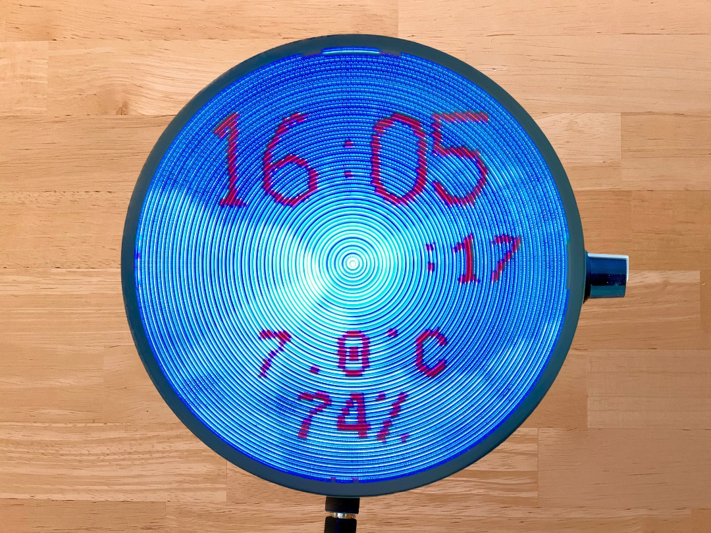

**Figure 4: operating modes.** Modes can be selected and configured through the web interface.

## 3. Mechanical design

The device consists of two assemblies: power supply and display. The power supply board is also the base plate, which can either be placed on a flat surface or hung on a wall. A standard CD motor is attached to this board so that the CD tray above the power supply board can accommodate the display assembly. The display board is fixed with two M2 x 6 mm screws. Furthermore, the base plate carries a potentiometer to control the motor speed as well as an on/off switch for the motor.

 
  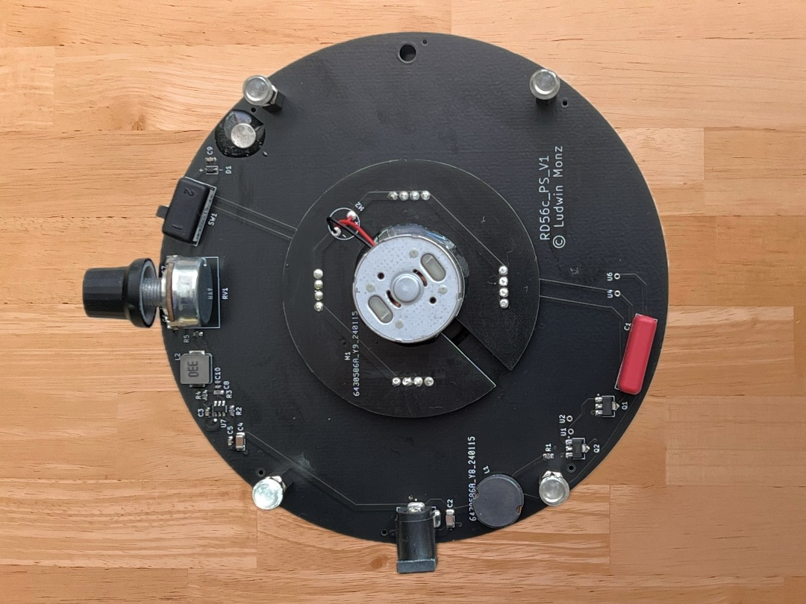
  

**Figure 5: Power Supply Board** with CD motor (middle), 12 - 24 V power jack (lower side), and speed potentiometer

An important requirement for the display board is that the center of mass of the unit is exactly in the middle, on the axis of rotation of the motor. This is the only way to ensure smooth and vibration-free running of the display. To achieve this, the electronic components are arranged symmetrically in three groups (**figure 7**). In the first group the components are arranged symmetrically to a vertical axis. This initially ensures that the center of gravity lies on this vertical axis. However, since the components cannot be distributed symmetrically to the horizontal axis of symmetry, the center of gravity must be shifted to the center along this axis using balancing weights. For this purpose, two M3x6mm screws with two nuts each are placed to the right and left of the ESP32 antenna. The second group of components is arranged symmetrically in respect to the center point of the disk and does not need a balancing weight, therefore. The third group, however, does need a balancing weight (M3 x 6, 1 nut) in the 4:30 position of the disk.The overall balancing result is very good, but can certainly be further optimized.

 
  
  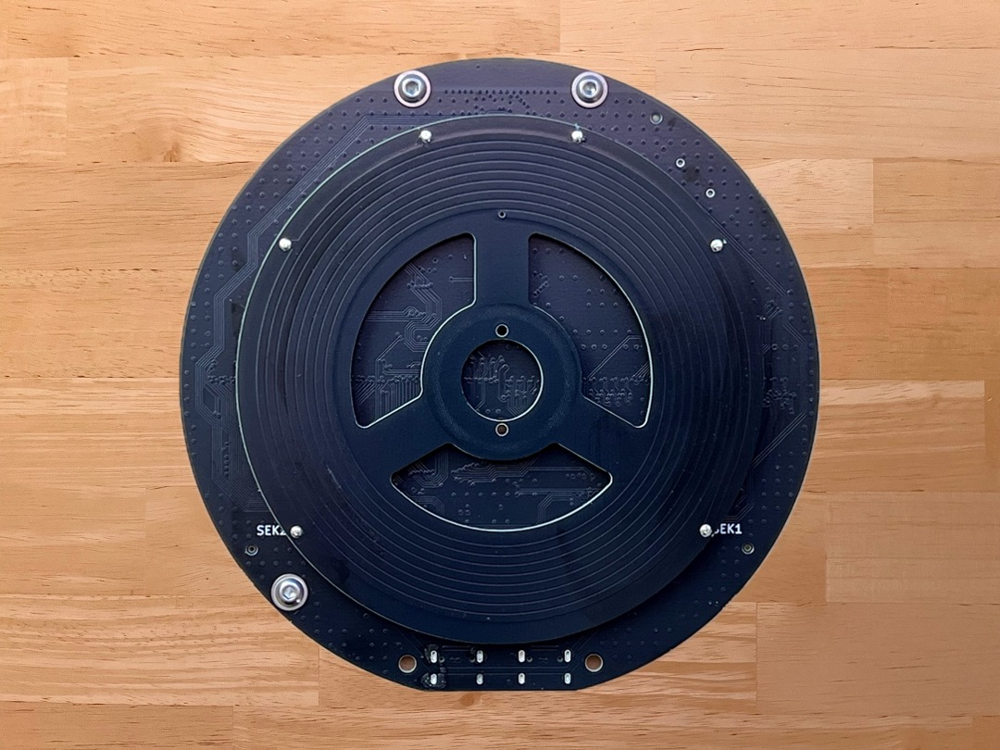

**Figure 6: Display Board.** Main components are the two LED rows, five serial shift register chips, and two microcontrollers (Arduino nano and ESP-01s). On the backside of the board the secondary coil of the wireless power supply is attached.

 
  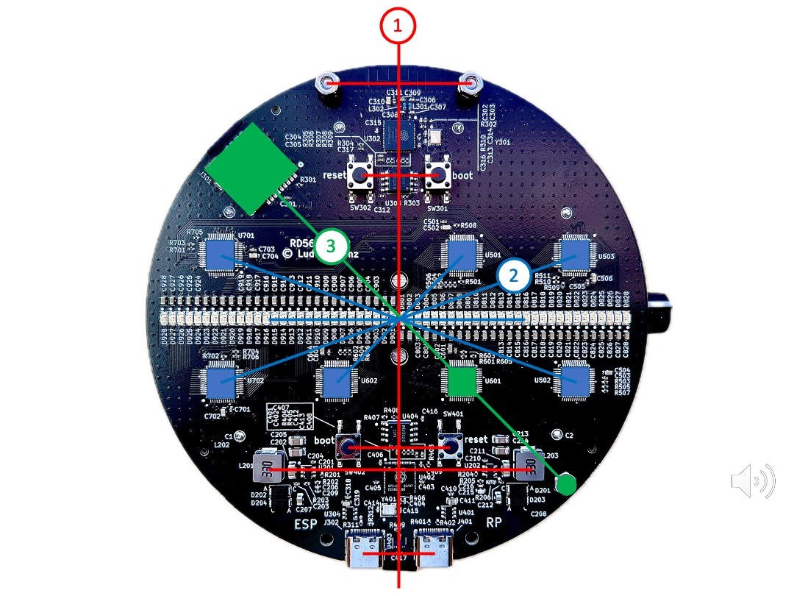

**Figure 7:** The components of the display board are arranged symmetrically in three groups. Balancing weights are used in group 1 and 3 to shift the center of gravity to the middle of the disk.

The LED row consists of 56 discrete, rectangular LEDs. The components each have a width of 1.6 mm and can be lined up with little spacing. The center of the LEDs is in a 2 mm grid. However, the row of LEDs is not arranged symmetrically to the center of the disk, but shifted by 0.5 mm. If the display panel is rotated by 180 degrees, this decentration causes the LEDs to be shifted by exactly 1 mm from the original grid (**figure 8**). This results in rotational interlacing: the radial resolution is increased from 2 to 1 mm. At the same time, the perceived frame rate also increases by a factor of 2..

 
  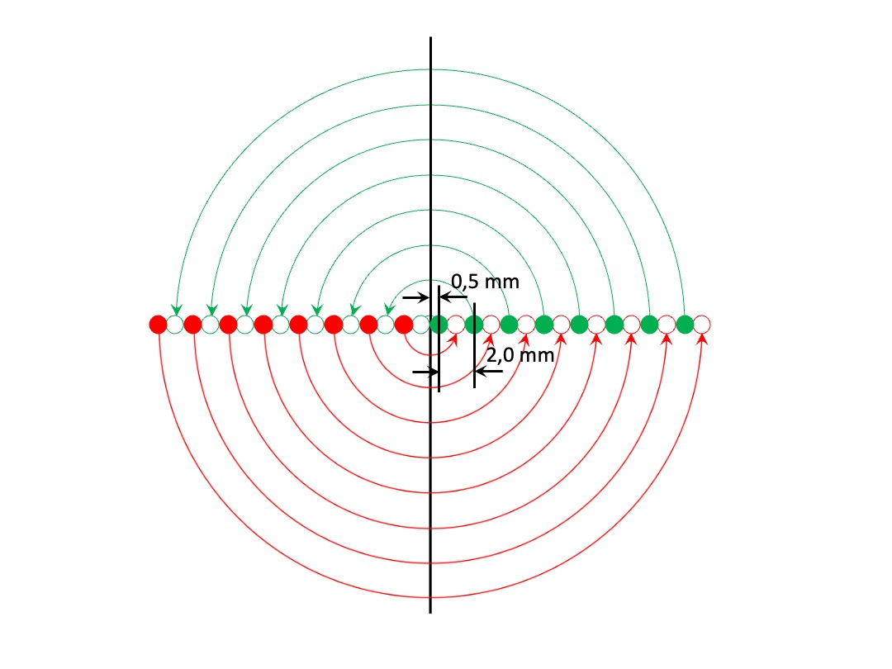

**Figure 8:** The LED row is shifted radially by half a LED width. The two halfs of the row generate an interlacing effect, which doubles both the radial resolution and the image frame rate.

The LEDs must output the image information at exactly the right position with each rotation. For spatial alignment of the image, a trigger signal is generated at a defined position for each rotation, which triggers the sequential, clocked output of the pixels. The trigger signal must be spatially very stable, otherwise no smooth image can be generated. It turned out that a Hall sensor is best suited for this purpose. It is located between the two USB-C connectors (see **figure 6**, left picture, bottom edge of the PCB). The magnet is glued into a hole of the power supply PCB (see figure 5, right picture, 2 o'clock position).

## 4. Electronics architecture

The distribution of the electronic circuitry between the two assemblies is shown in **figure 9**. The power supply assembly contains a Royer converter for wireless power transfer to the display assembly and an adjustment of the motor speed. The 56 color LEDs of the display assembly are controlled by 7 shift registers (24 bits each), which in turn are supplied with clock and data by a RP2040 microcontroller via an SPI interface. The displayed content is generated by an ESP32-S3 microcontroller, which is connected to the internet via Wifi. Furthermore, image data can be loaded from a micro SD card. The ESP32 transmits its data to the RP2040 via a SPI interface.

 
  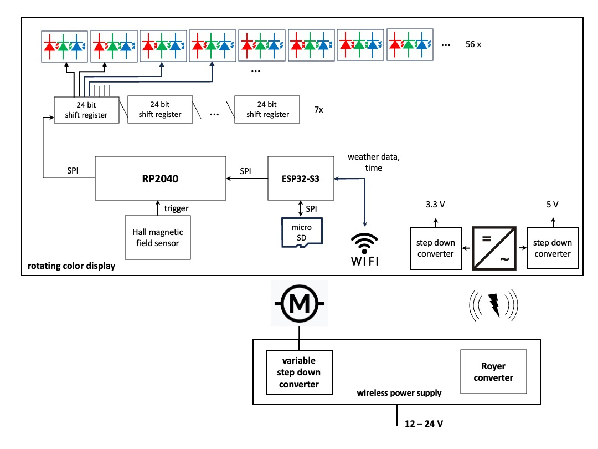

**Figure 9: electronics schematics.**

## 5. Power supply board

The core of the power supply is a Royer converter for wireless power transfer. An excellent article on the operation and design of the circuit can be found at Mikrocontroller.net (German) and the circuit was taken from there. Two transistors are alternately switched (push pull operation) so that a current flows through one half of the coil at a time. The coil belongs to a resonant circuit with a resonant frequency of about 120 kHz. The control voltage for the transistors is obtained via a coupling coil (**figure 10**). The secondary coil is located below the display board (see **figure 6**, right).

The Royer circuit uses very few components. However, the coil is quite complex. It is a bifilar coil, where the two halves are interleaved. In addition, the coupling coil must be connected with the correct polarity, otherwise the two transistors will be destroyed. In the early stages of development, the coil was wound with copper wire. However, this solution was quite difficult to reproduce, so in the final design the coils (bifilar primary coil, coupling coil, secondary coil) were implemented as a printed circuit (see **figure 5**, right and **figure 6** right). The circuit was found to have surprisingly high and perfectly adequate transmission efficiency, although the quality factor of the printed coils is inevitably compromised. The Royer converter with the printed coil assembly is absolutely safe to rebuild.

The Royer converter can be supplied with 12 to 24 V. Depending on the voltage, the transferred power can be increased. This allows the operation of the display at high brightness. However, even with 12 V supply, the available power is sufficient for normal operation. 

 
  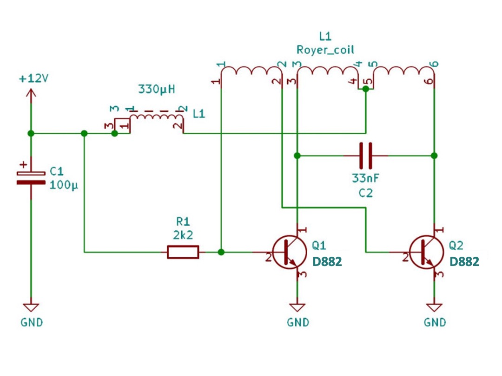

**Figure 10: Royer converter**. Compare Mikrocontroller.net for reference.

There is also a circuit for supplying the CD motor on the power supply board (**figure 11**). As the supply voltage can be vary from 12 to 24 V, a step down converter is used to generate a variable voltage between 1.7V and 6.0V, which can be adjusted via a potentiometer. The voltage range corresponds to the specified operating range of the CD motor. The supply of the motor can be interrupted with a switch, for example to allow programming of the microcontrollers.

 
  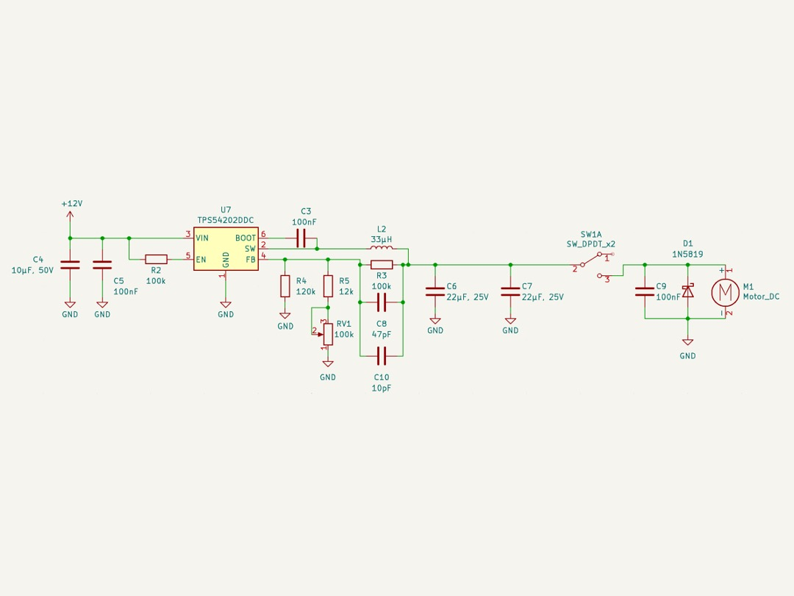

**Figure 11: variable voltage regulator** for driving the CD motor

## 6. Display Board

**a) The LEDs**

The 56 LEDs of the display board are driven by 7 cascaded 24-bit shift registers (**figure 12**). The registers load the serial data stream from one of the SPI interfaces of the RP2040. The microcontroller generates separate "LED enable" signal for the R, G, B LEDs, respectively. This allows for white balancing (not implemented yet). The STP24DP05BTR LED current sink controller sets the LED current to 20mA each. The maximum current per register would therefore be 480mA, if all LEDs were on, simultaneously and continuously. Theoretically, the current of the 56 LEDs could add up to 3.3A, which, at 5V, would correspond to 16.5 W. This is significantly beyond the capability of the wireless power supply. However, the current can be controlled by the RP2040 microcontroller by setting the duty cycle appropriately.

 
  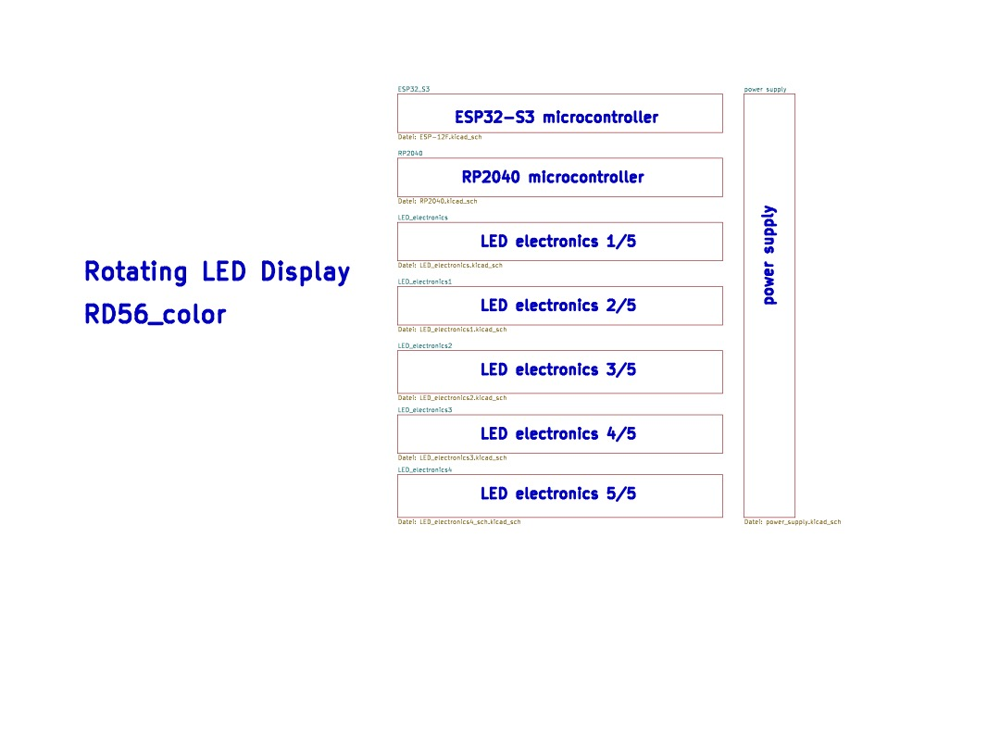

 
  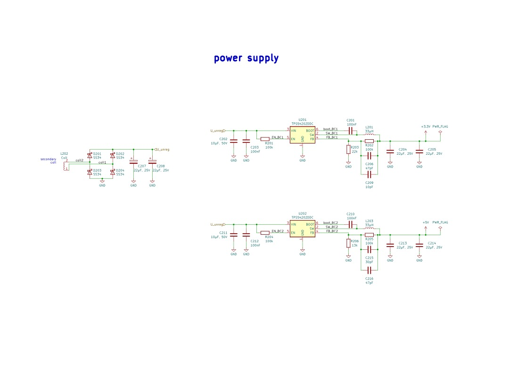

 
  

 
  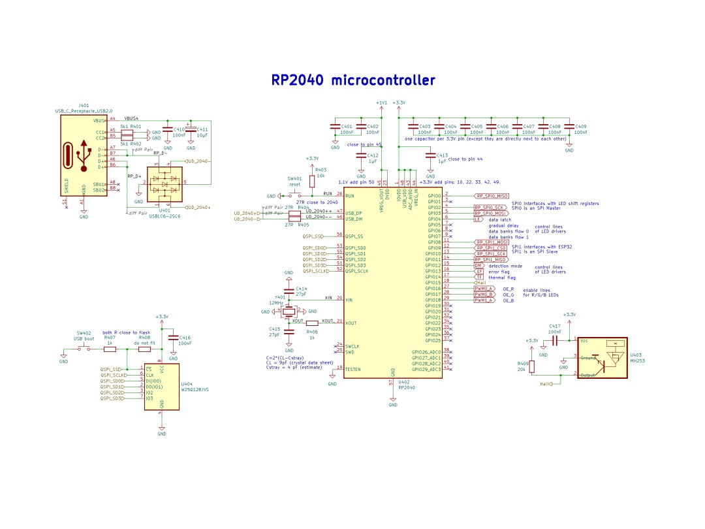

 
  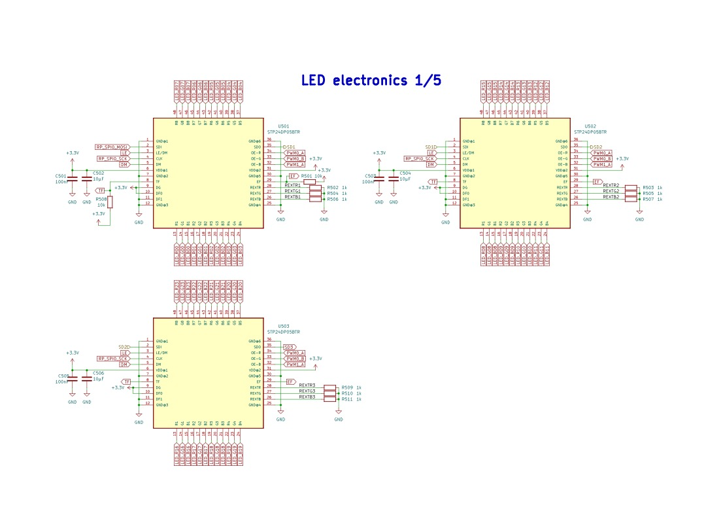

 
  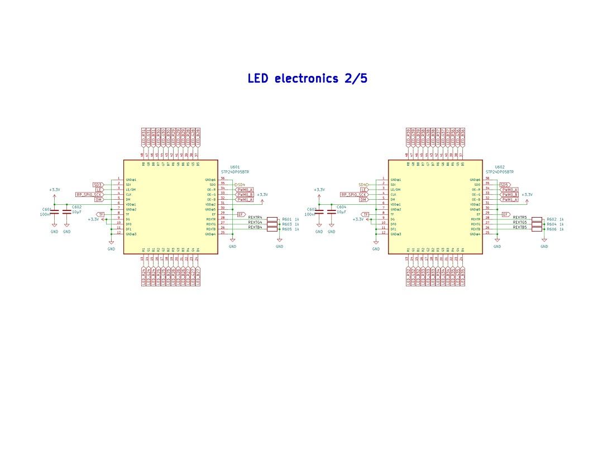

 
  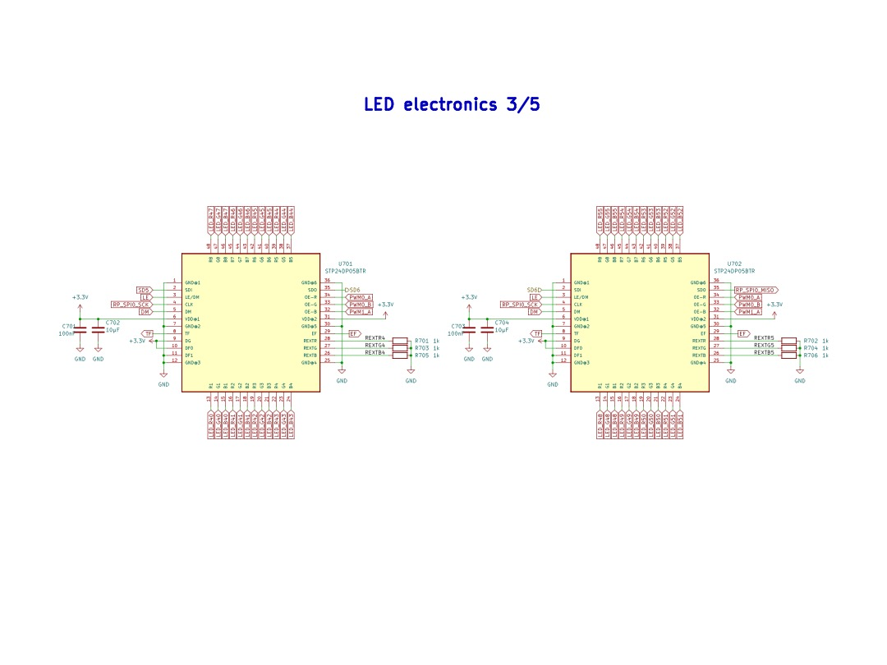

 
  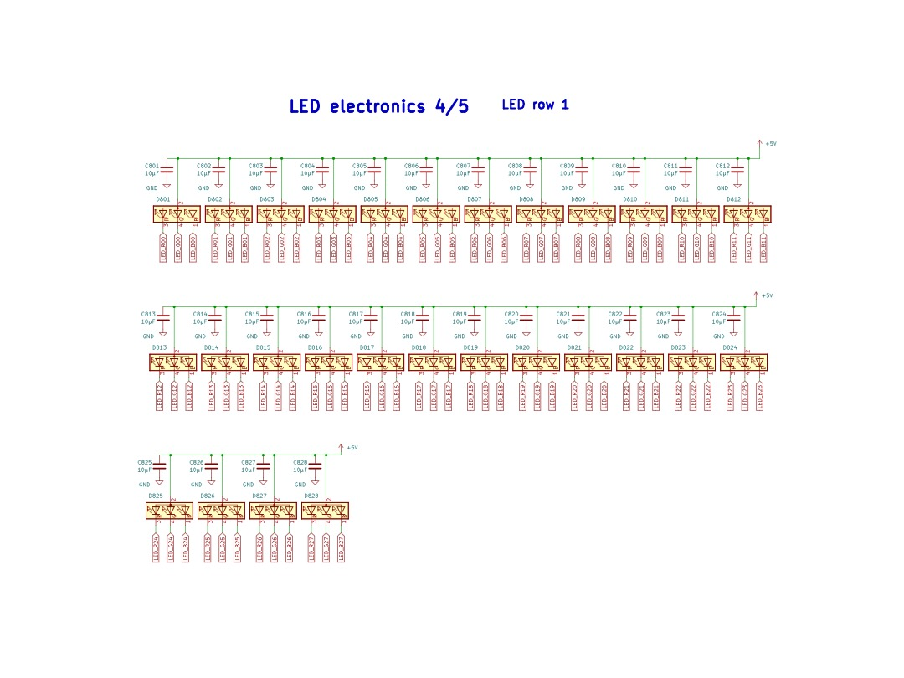

 
  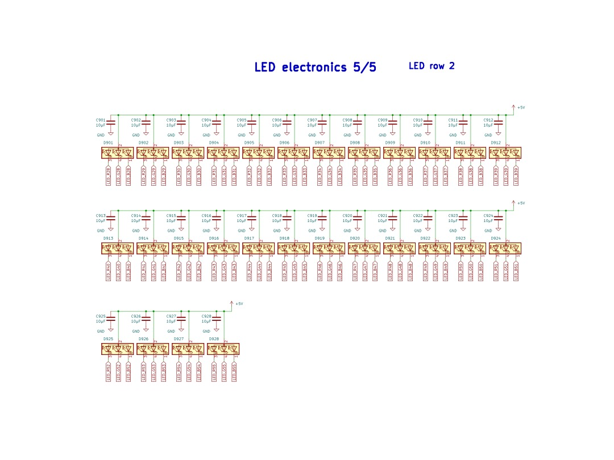

**Figure 12: circuit diagrams of the display board**. Diagrams also available as download and on Github.

**b) Displaying color**

Displaying color is based on additive color mixing. The three primary colors, red, green, and blue are mixed with different intensities. For example red and green combined at equal intensity make yellow. However, the circuit only allows the LEDs to be either on or off. Intensity can only be set using pulse width modulation. In order to synchronize PWM with the rotation of the disk, each pixel is devided into 8 sub-pixels (**figure 13**). This allows for setting the intensity in 8 steps for red, green, and blue, respectively. The color space can be displayed with 8 x 8 x 8 = 512 colors.

 
  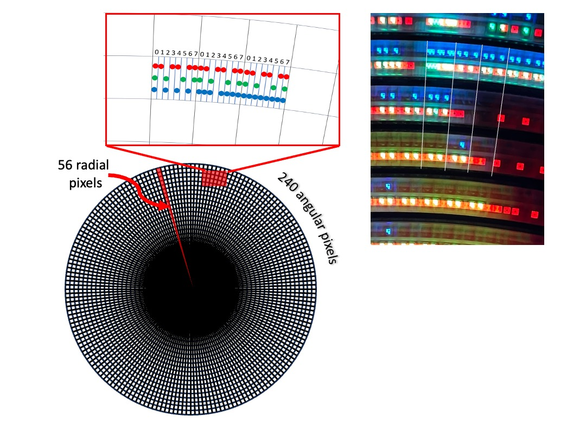

**Figure 13: displaying color**. each pixel is divided into 8 sub-pixels. This allows for pulse width modulation of the LED intensity. The intensity resolution is 8 steps for red, green, and blue, respectively. On the right hand side there is a photo of some of the pixels of the running display.

**c) RP2040 interrupts and timing**

The SPI interface is operated with a clock rate of 25 MHz. The 168 bits (56 RGB LEDs, 3 colors each) are therefore transferred in 168 x 1/25MHz = 6.7µs. Assuming a maximum rotation speed of the display of 1200 RPM, this corresponds to 50ms per revolution. At one full rotation of the display 240 pixels with 8 sub-pixels each are output per LED. This corresponds to 26µs per sub-pixel. Thus, the transmission time via the SPI bus (6.7µs) is significantly shorter than the display time per sub-pixel.

The idea of using two microcontrollers (RP2040 and ESP32-S3) is essentially to separate the very time-critical timing of the LED control from the computationally intensive and asynchronous image generation and internet communication. In this way, the RP2040 is relieved to the maximum and the display of the image is extremely stable.

The software of the RP2040 programmed in C consists of two short interrupt routines. The first routine ("HallIRQ") is triggered by the Hall sensor exactly once for each full rotation (**figure 14**). This routine starts a timer, which sets the duration for which a single row of 56 color pixels is displayed. Once the timer expires, it is automatically restarted and a second interrupt routine is triggered ("PixelIRQ"). In this second routine the bit pattern of the LEDs is updated. So in this way a new LED pattern appears with each expiration of the timer. It is important that the timer restarts automatically (hardware controlled). Otherwise there could be a delay if the processor cannot start the interrupt routine immediately (because another routine prevents this, for example).

Another important function is to set the duration of the timer 1 so that exactly 240 x 8 = 1920 pixel rows per turn are output. For this purpose, the variable "tpt" (time per turn) is increased by the set value of the timer with each call of PixelIRQ. The routine HallTRQ can read tpt and thus knows the exact time duration for one revolution - even if it consists of more or less than 1920 timer cycles. The new time per pixel (tpt/240) is then calculated from this value and the timer is set accordingly.

To control the image brightness of the red, green, and blue LEDs, the threshold function of the timer is used: as soon as a programmable threshold for R, G, and B is exceeded, an output of the RP2040 switches. The three signals are used to switch on the respective LEDs for the selected time. Controlling the brightness of R, G, and B separately allows to adjust the relative brightness of the three channels and therefore to shift the white point and thus color balancing the display. However, it has turned out that the LEDs are calibrated such that a reasonable "white" is achieved when the LED current is set to 20 mA for the three LEDs, respectively.

 
  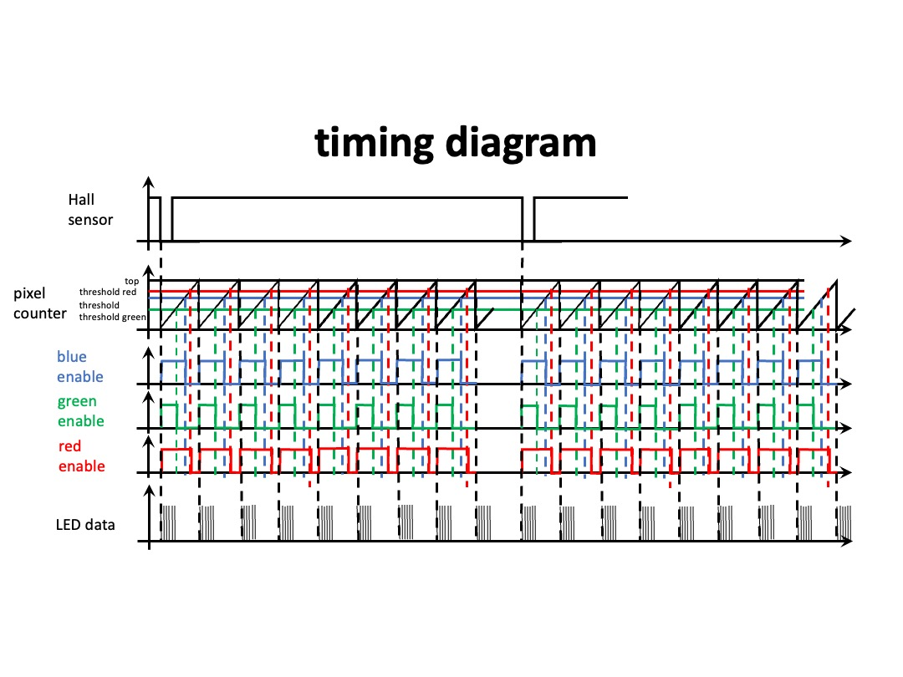

**Figure 14: RP2040 interrupt timing.** The timer clocks the pixel output and sets the LED brightness.

**d) ESP32-S3 for Internet communication and image generation**

The microcontroller ESP32 has a Wifi module for internet communication. The antenna of the controller is placed at the edge of the display board, because the interference field of the wireless power supply is lowest there. 

Although a concern in the beginning of the development, it turned out that the fast rotation of the display does not lead to any noticeable impairment of the Wifi connection.

**e) Programming of the microcontrollers**

The RP2040 can be programmed via a USB-C socket. During programming the power supply of the display needs to be on. Should there be a connection problem between the RP2040 and the programming computer, it helps to start the controller in boot mode. In order to do so, push and hold the RP2040 boot button while powering on the device. Once power is on, you can release the button.

Programming the ESP32S3 via its USB-C connector is easy and reliable as well. There is also a boot button, which can be used for initializing the controller.

Please note that the HTML, CSS and JS code of the user interface webpages has to be loaded onto the micro SD card. Make sure to properly formate (FAT16) the card before copying the data. You need to copy all files and folders in the "data" subfolder of the ESP32 directory of the repository to the root level of the SD card. When done, there. should be the folders "html", "variables", and "images" on the highest level of the SD card. 

# 7. The Software of the ESP32

The ESP-32 handles the generation of the image data and its transmission to the RP2040 (rouphly 10 times per second). The displayed information (time and weather data) is retrieved from the Internet or read from the SD card (still images and animated images). Furthermore, the microcontroller serves as a simple HTML web server that can be accessed by any browser to control the display.

**a) Generation of the image data**

Even though the resolution of the display achieved with the 56 color LEDs is relatively low, it is sufficient to display images and text upright, undistorted and therefore easily readable. The image data is generated in a rectangular pixel matrix (i.e. a cartesian coordinate system) with 110 x 110 pixels (**figure 15**). This bitmap then has to be transformed into the polar coordinate system of the rotating LED rows, before it is transferred to the RP2040. To make the transformation fast, a lookup table is used, which transforms the x,y coordinates of the bitmap into the r, theta coordinates of the rotating LED lines. The transformation also takes into account the alternating order of the LEDs between the two halfs of the row.

 
  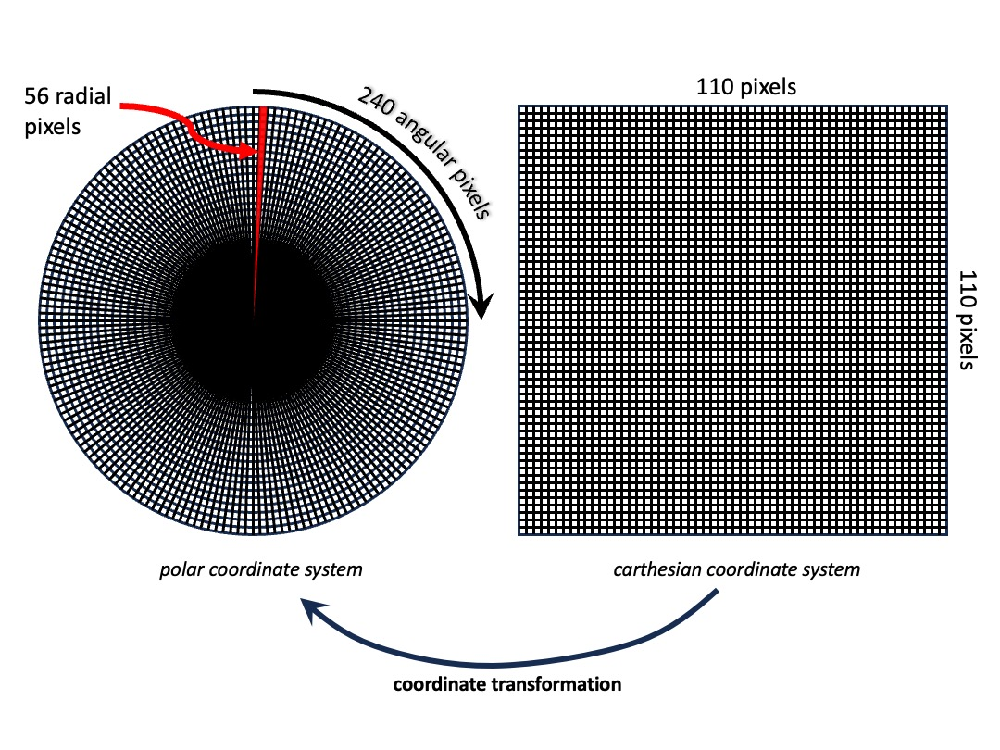

**Figure 15:** The display handles a **110x110 pixel bitmap**, which is transformed into the polar coordinate system of the rotating LED rows

**b) Control of the display via web interface**

For the implementation of the web server the library ESPAsyncWebServer is used. It has the advantage that the server activity runs in the background independent of other processes running simultaneously on the controller. The server retrieves the HTML, CSS and JS data of the displayed web pages from the SD card file system. Therefore, the web pages and the server can be implemented independently. Retrieving or modifying data is done using the HTTP GET and POST methods.

Certain parameters (brightness of the LEDs, operating mode of the display) can be set via the web interface. In addition, configuration data, such as the access data to the weather service openweather.org or the Wifi data can be edited and saved. These data are also stored in the file system of the SD card and are therefore also available after a reboot.

The user interface of the device has a file browser with which files can be uploaded from the end device (e.g. mobile device) to the SD card or downloaded from the SD card. This is especially usefull for loading image data to the device. In addition, files and entire directories can be deleted, renamed and moved. This simplifies the organization of the flash disk considerably.

Furthermore, the web interface provides a page for converting, uploading, and organizing images ("RDC Image Manager"). Still images can be uploaded in almost any image format and resolution. The software down scales and converts the images into the proprietary ".rdc" format ("rdc" = rotating display color). This format stores the color pixels sequentially, non-compressed, using 3 x 4 bits (1,5 bytes) per pixel. 

The RDC Image Manager can also deal with animated GIF files. As the image update rate is limited (about 10 images per second), there is an option to reduce the number of frames of the animated sequence. Please note, that saving an animated ".rdc" file might take a while, as the filesize can be substantial.

Known bug: the upload of animated ".rdc" files might lead to corrupt files, sometimes. The cause has not been clarified yet.

**c) Software architecture**

The ESP32 software is written in C++. In order to keep an overview despite the large amount of software, the function blocks and the data have been divided into classes. The following is a brief description of the most important classes:

Class RD40

The class provides the central rotating display object. It manages the (private) data of the displayed image (four bits per color and three colors per pixel). The class has methods for displaying bitmaps and for passing data to the display controller.

Class myBMP

This class creates 110x110 color bitmaps for display. It uses private methods to print text on the bitmap, draw lines and circles, or load images.

Class WebInterface

This class manages the web user interface. Once the webInterface object has been initiated, the web server will run in the background without the need for any attention from the software. The class provides certain attributes, such as clockMode and brightness, which are managed by the web interface. The user can change configuration data via the web interface. The data is then stored as parameter files on the SD card.

Not being a software engineer myself, the source code would most certainly benefit from a code review and revision.

**d) Development Environment**

Visual Studio Code with the PlatformIO extension was used as the development environment for both RP2040 and ESP32. The environment is much faster and more comfortable than the Arduino IDE. The ini files of the respective projects manages all settings, including libraries necessary for compiling. 
In addition, Visual Studio Code can also be used for the development of the source code of the web pages.

## 8. Reproduction of the rotating display

All necessary data, such as source code, circuit diagrams, printed board layouts, parts list and sources of supply are included either in this article or in my public github repository. They may be used for non-commercial purposes, such as by hobbyists or in education, whether for reproduction or further development. Either way, please respect the terms of the license.

The two main boards (display board and power supply board) can be manufactured based on the provided production data. The prototypes were manufactured and assembled by JLCPCB. The production data, including Gerber files, BOM, and component position files, are included in the repository. 

Some components need to be soldered manually, as they are through-hole-components. Please refer to the following description. The assembly is relatively simple, although some soldering skills are required. 

 
  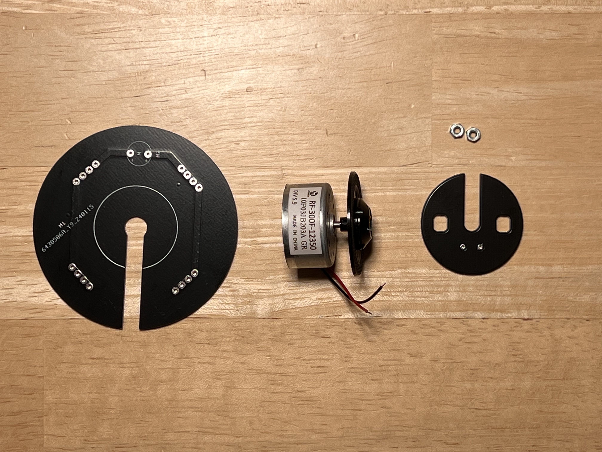
  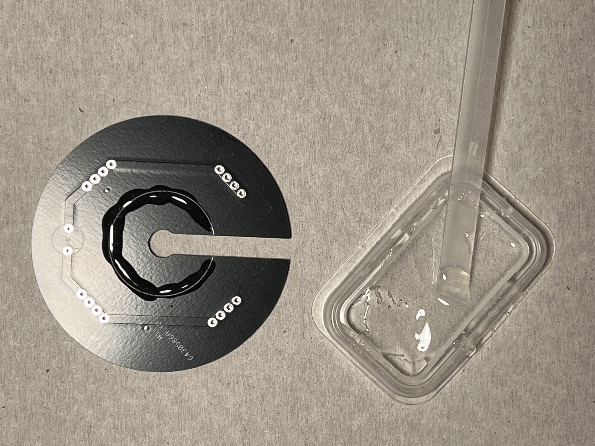

 
  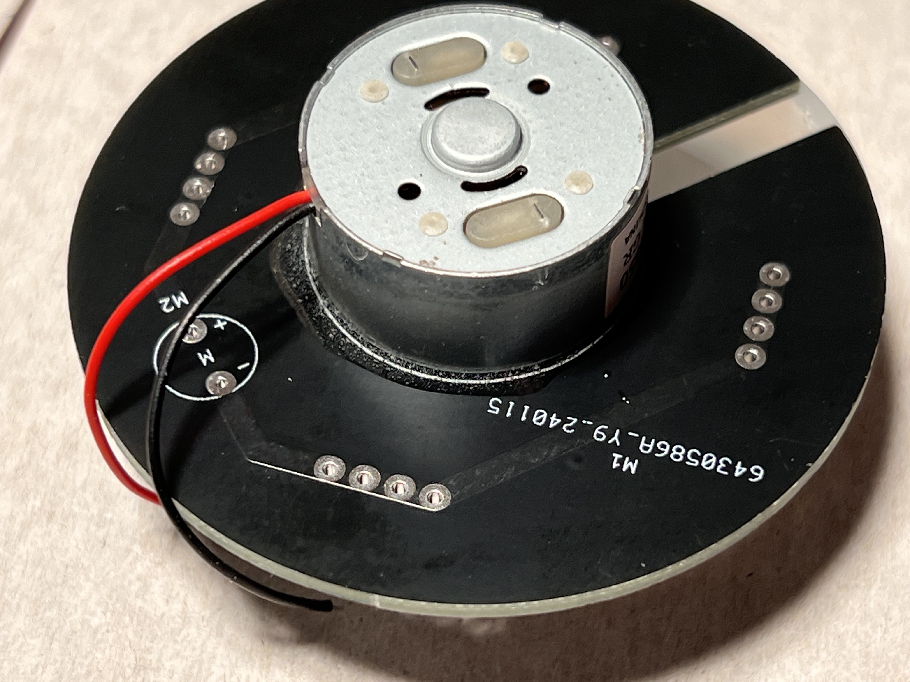
  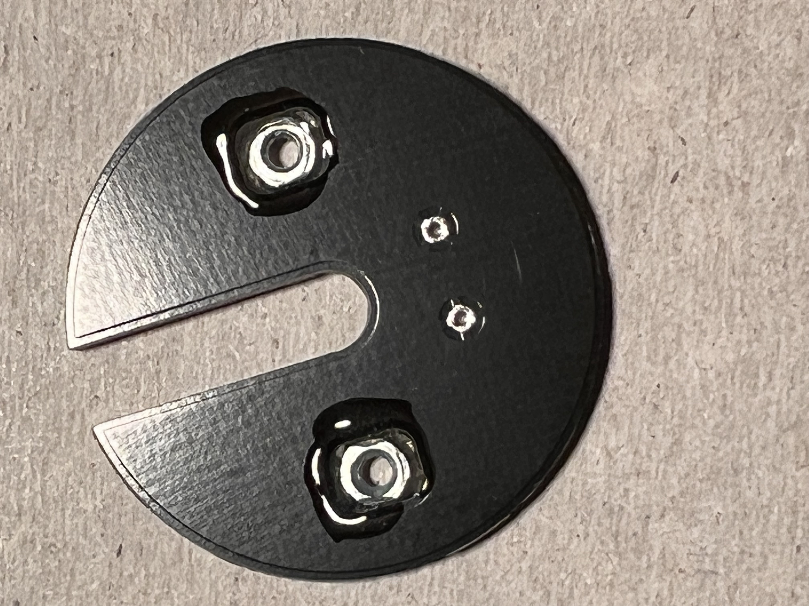

**Figure 16:** Start with the assembly of the power supply board. Use fast curing two component epoxy resin to glue the CD motor to the carrier plate. Furthermore, carefully glue two M2 nuts to the CD tray auxilliary plate, without contaminating the threats.

 
  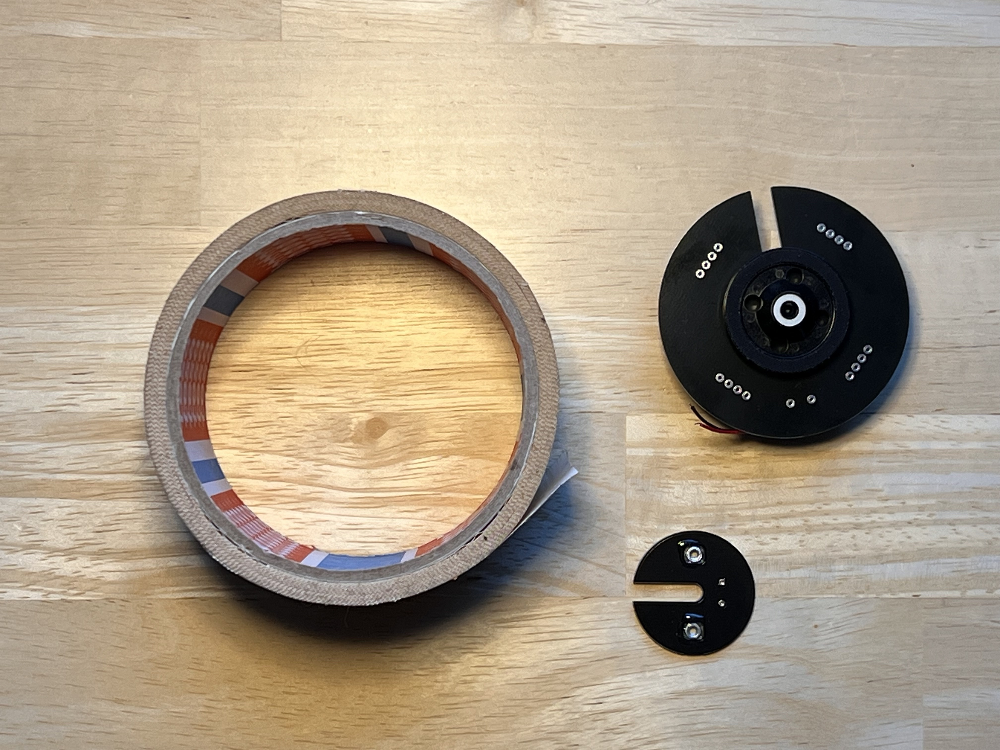
  

 
  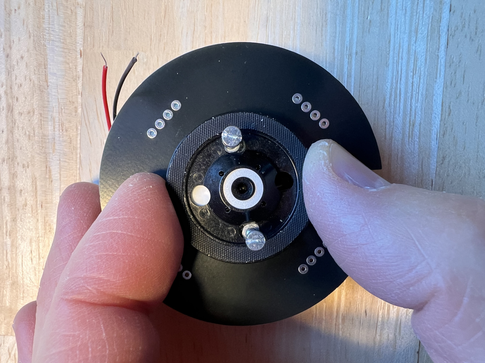

**Figure 17:** Use double sided tape to attache the auxilliary plate with the two M2 nuts to the back of the CD tray. By means of two M2 screws you can make sure the plate is in the right position.

 
  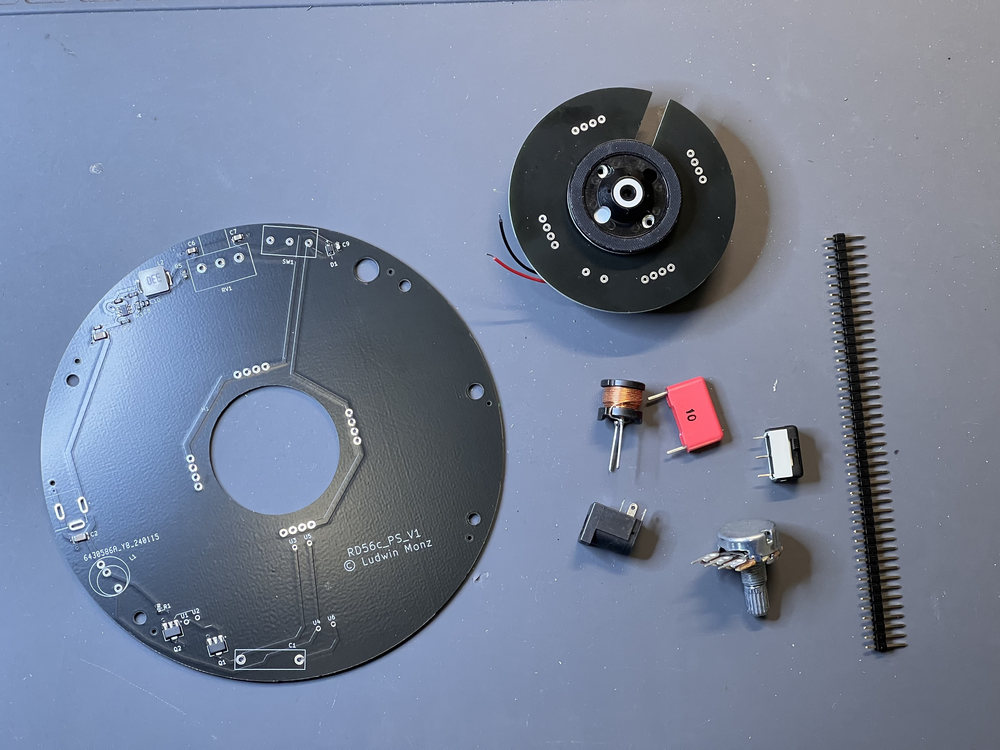
  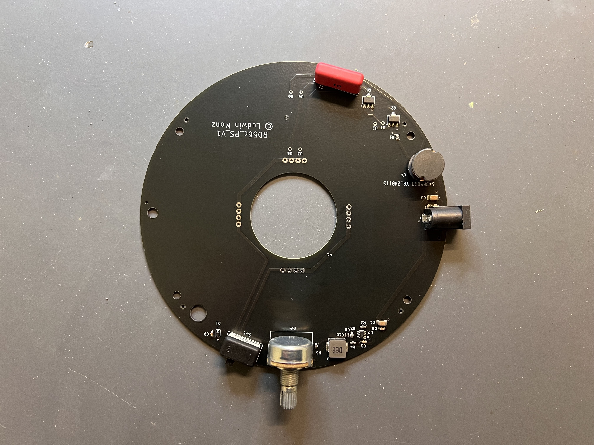

 
  
  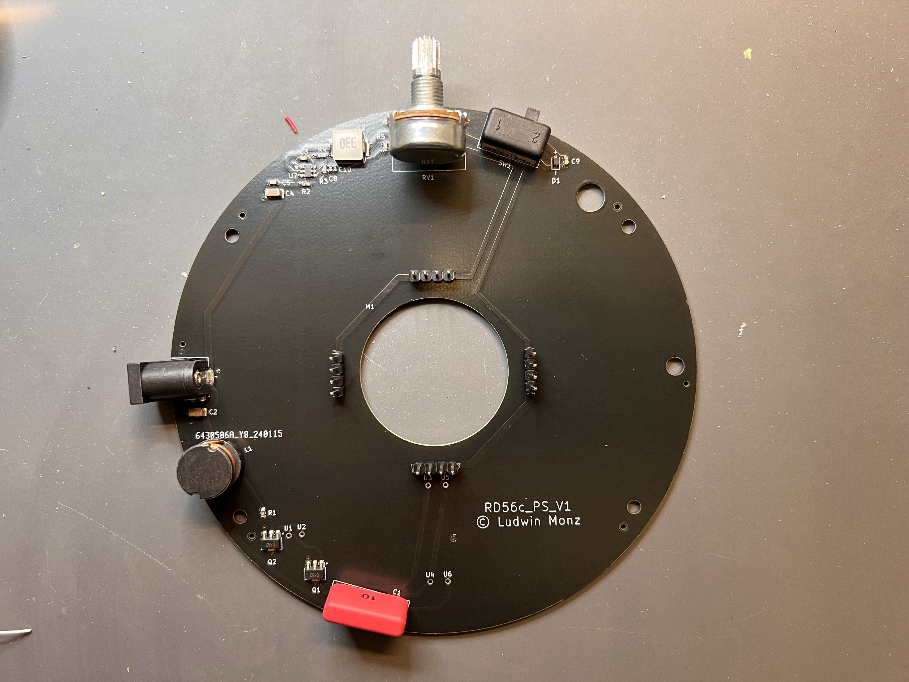

 
  

**Figure 18:** Solder the through-hole components to the power supply board. Use 4-pin connectors to attach the motor assembly to the power supply pcb. Screw four 20 mm bolts to the pcb.

 
  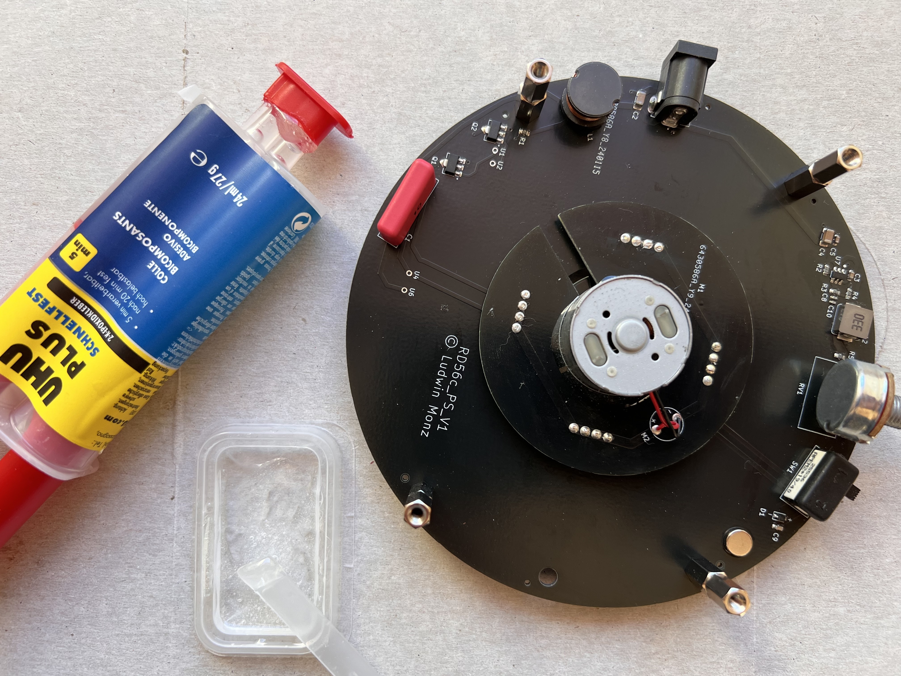
  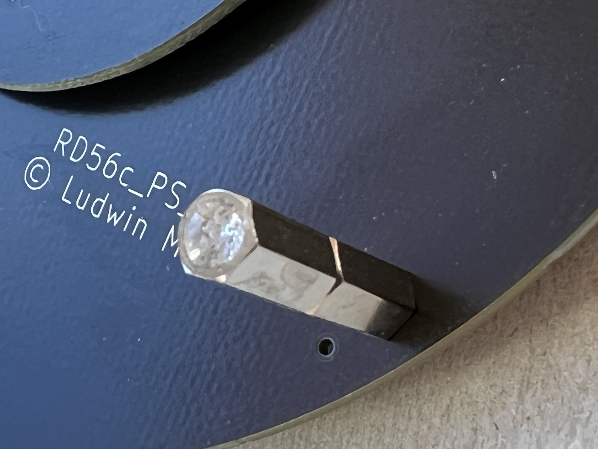

 
  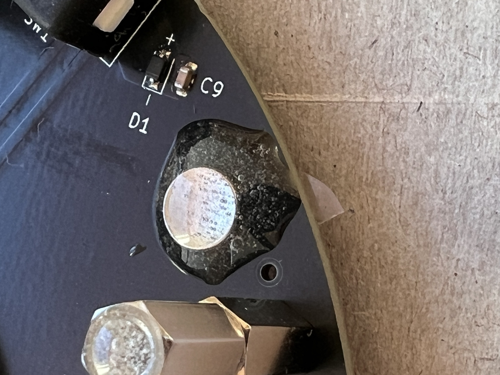

**Figure 19:** Glue rupper bumpers onto the bolts. Furthermore, glue the magnet into the respective hole in the power supply board. As the Hall sensor used can deal with any direction of the magnetic field, the orientation of the magnet does not matter.

 
  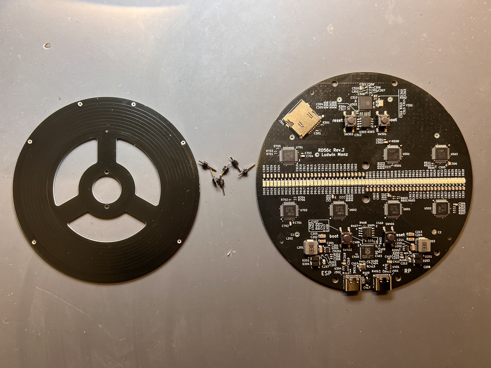
  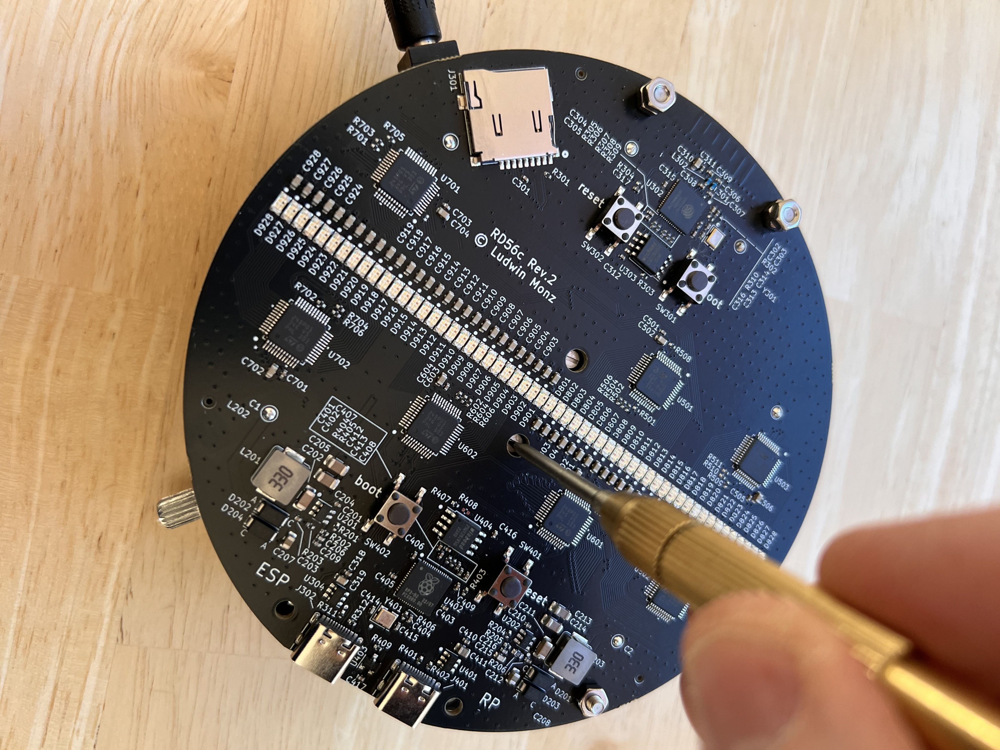

**Figure 20:** Use 6 pins to attach the secondary coil pcb to the back of the display board. Make sure, the two boards are connected and soldered tensionlessly, as the relative position between the two boards needs to be as precise as possible. Finally, use two M2 x 6 screws to attach the display pcb to the power supply assembly.

## 9. Conclusions

The rotating color display works according to a simple principle. However, the development of the Rotating Color Display device presented numerous highly interesting engineering challenges. Finding solutions for this was not only very interesting, but an opportunity to learn a wide variety of technologies. Last but not least, it was an intellectual challenge that I enjoyed a lot.

Worth mentioning are:

* Simple design with few mechanical components
* Replicable wireless power supply with printed coils
* interlacing for higher resolution and less flickering
* Complete balancing of the display board to ensure vibration-free operation
* Timer controlled clocking of the color LEDs and independent regulation of the R, G, and B brightness
* User-friendly user interface via a standard web browser
* Retrieval of time and weather data from the internet
* Display of animated GIF images
* Implementation of a file browser for the SD card for uploading image data
* Transparent, object-oriented structure of the ESP32 software
